# Tracks
## Track update interval
Track data is updated 00:01 UTC daily. Actual update time may vary slightly due to the way actions are scheduled.
## Available tracks
Currently there are **62 tracks** available in the dataset.
| Image                                                                                                                                        | Name                                     | Release Date           | Numpy Files                                                                                                                                                                                          | Track Length   | Track Width   |
|----------------------------------------------------------------------------------------------------------------------------------------------|------------------------------------------|------------------------|------------------------------------------------------------------------------------------------------------------------------------------------------------------------------------------------------|----------------|---------------|
| 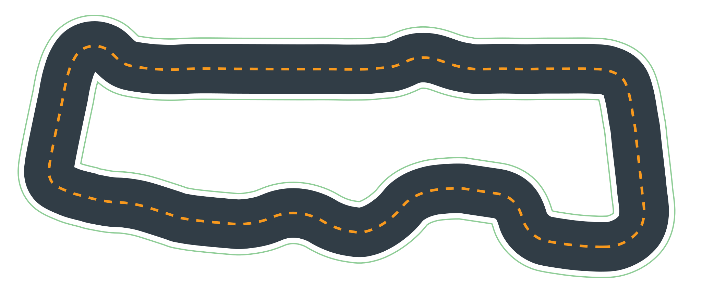                  | **Forever Raceway**                      | *2024-10-01T00:00:00Z* | [2024_reinvent_champ_cw.npy](././npy/2024_reinvent_champ_cw.npy) [2024_reinvent_champ_ccw.npy](././npy/2024_reinvent_champ_ccw.npy)                                                                  | 25.10 meters   | 0.76 meters   |
| 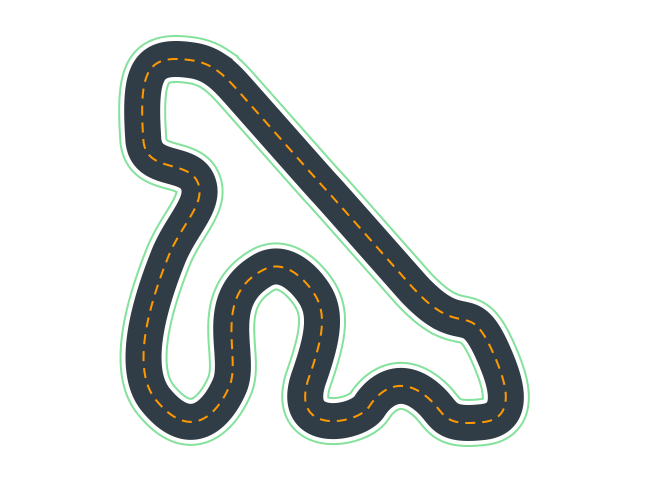      | **2022 re:Invent Championship**          | *2022-09-30T17:00:00Z* | [2022_reinvent_champ_cw.npy](././npy/2022_reinvent_champ_cw.npy) [2022_reinvent_champ_ccw.npy](././npy/2022_reinvent_champ_ccw.npy) [2022_reinvent_champ.npy](././npy/2022_reinvent_champ.npy)       | 33.27 meters   | 0.01 meters   |
| 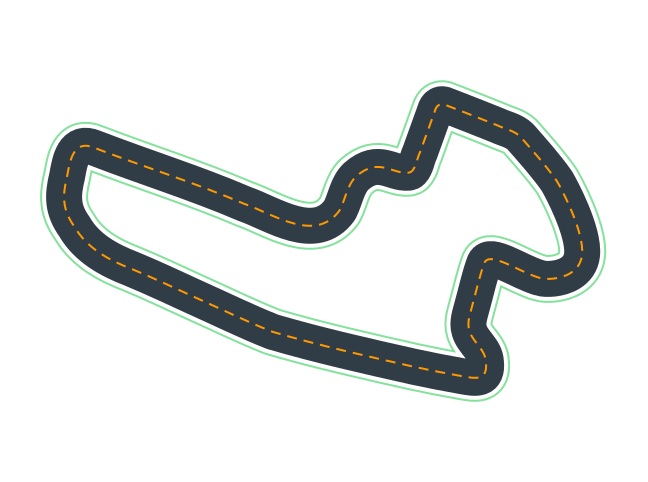                 | **Jennens Super Speedway**               | *2022-09-30T17:00:00Z* | [2022_october_pro_ccw.npy](././npy/2022_october_pro_ccw.npy) [2022_october_pro_cw.npy](././npy/2022_october_pro_cw.npy) [2022_october_pro.npy](././npy/2022_october_pro.npy)                         | 62.08 meters   | 0.01 meters   |
| 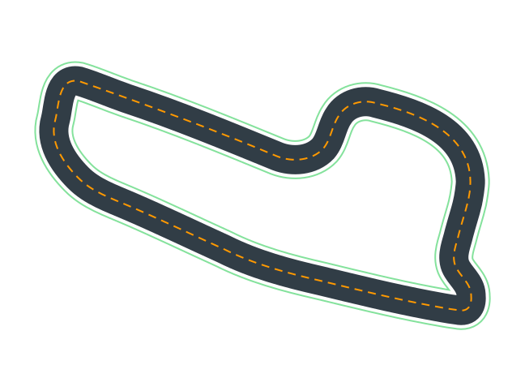              | **Jennens Family Speedway**              | *2022-09-30T17:00:00Z* | [2022_october_open_cw.npy](././npy/2022_october_open_cw.npy) [2022_october_open_ccw.npy](././npy/2022_october_open_ccw.npy) [2022_october_open.npy](././npy/2022_october_open.npy)                   | 49.57 meters   | 0.01 meters   |
| 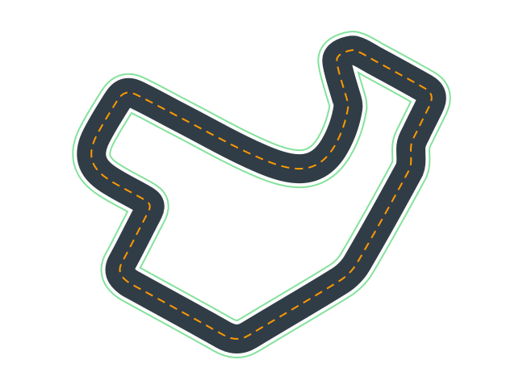                | **Roger Super Raceway**                  | *2022-09-01T00:00:00Z* | [2022_september_pro_cw.npy](././npy/2022_september_pro_cw.npy) [2022_september_pro.npy](././npy/2022_september_pro.npy) [2022_september_pro_ccw.npy](././npy/2022_september_pro_ccw.npy)             | 60.18 meters   | 1.07 meters   |
|                        | **Roger Ring**                           | *2022-09-01T00:00:00Z* | [2022_september_open.npy](././npy/2022_september_open.npy) [2022_september_open_cw.npy](././npy/2022_september_open_cw.npy) [2022_september_open_ccw.npy](././npy/2022_september_open_ccw.npy)       | 45.30 meters   | 1.07 meters   |
| 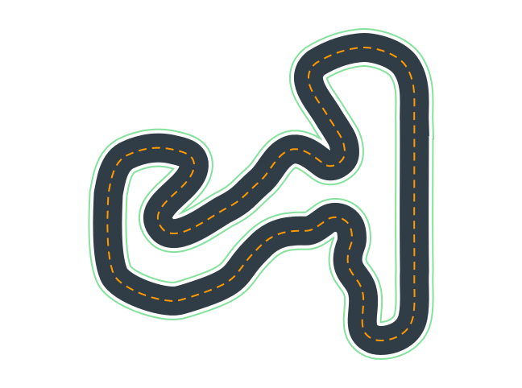                           | **Jochem Highway**                       | *2022-08-01T00:00:00Z* | [2022_august_pro_cw.npy](././npy/2022_august_pro_cw.npy) [2022_august_pro.npy](././npy/2022_august_pro.npy) [2022_august_pro_ccw.npy](././npy/2022_august_pro_ccw.npy)                               | 63.88 meters   | 1.07 meters   |
| 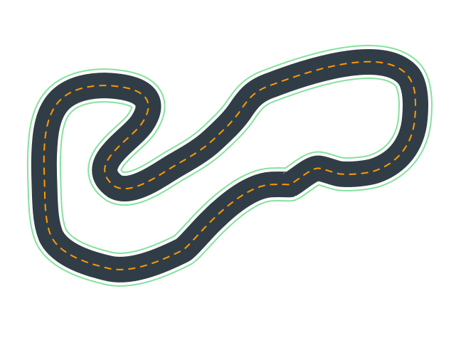                        | **Jochem Turnpike**                      | *2022-08-01T00:00:00Z* | [2022_august_open.npy](././npy/2022_august_open.npy) [2022_august_open_ccw.npy](././npy/2022_august_open_ccw.npy) [2022_august_open_cw.npy](././npy/2022_august_open_cw.npy)                         | 43.31 meters   | 1.07 meters   |
| 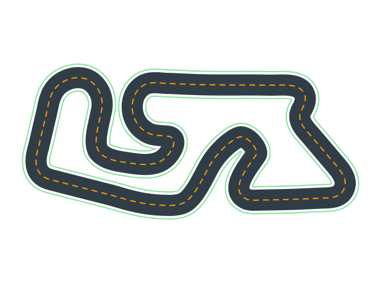                           | **DBro Super Raceway**                   | *2022-07-01T00:00:00Z* | [2022_july_pro_cw.npy](././npy/2022_july_pro_cw.npy) [2022_july_pro.npy](././npy/2022_july_pro.npy) [2022_july_pro_ccw.npy](././npy/2022_july_pro_ccw.npy)                                           | 57.89 meters   | 1.07 meters   |
| 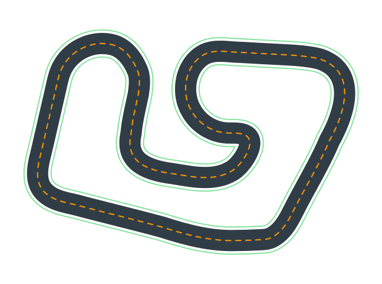                               | **DBro Raceway**                         | *2022-07-01T00:00:00Z* | [2022_july_open.npy](././npy/2022_july_open.npy)                                                                                                                                                     | 40.20 meters   | 1.07 meters   |
| 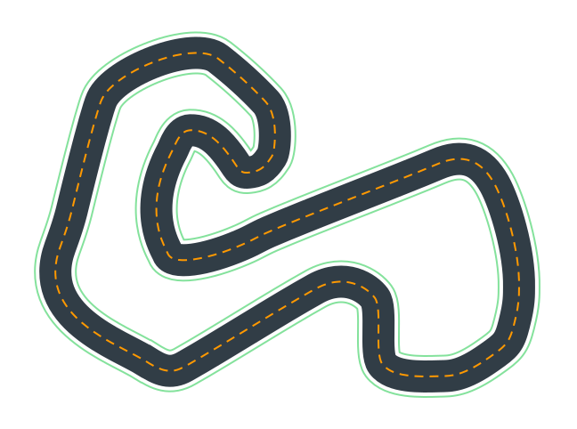                        | **BreadCentric Speedway**                | *2022-06-01T00:00:00Z* | [2022_june_pro_cw.npy](././npy/2022_june_pro_cw.npy) [2022_june_pro_ccw.npy](././npy/2022_june_pro_ccw.npy) [2022_june_pro.npy](././npy/2022_june_pro.npy)                                           | 58.61 meters   | 1.07 meters   |
| 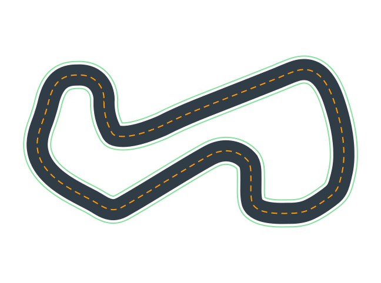                          | **BreadCentric Loop**                    | *2022-06-01T00:00:00Z* | [2022_june_open_ccw.npy](././npy/2022_june_open_ccw.npy) [2022_june_open.npy](././npy/2022_june_open.npy) [2022_june_open_cw.npy](././npy/2022_june_open_cw.npy)                                     | 41.28 meters   | 1.07 meters   |
| 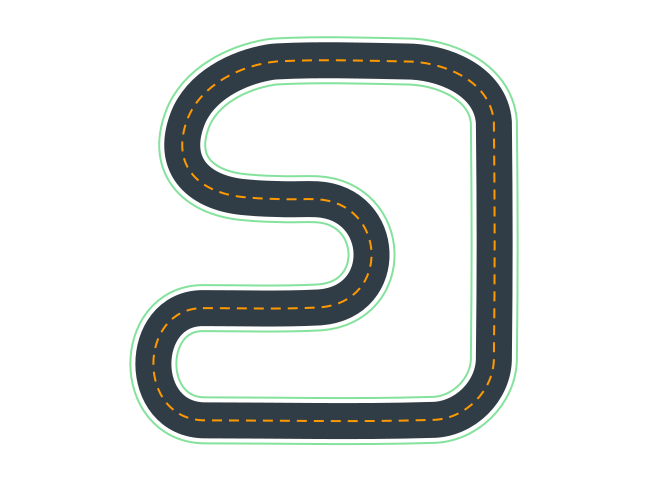                                 | **Ross Raceway**                         | *2022-05-01T00:00:00Z* | [2022_may_open_cw.npy](././npy/2022_may_open_cw.npy) [2022_may_open_ccw.npy](././npy/2022_may_open_ccw.npy) [2022_may_open.npy](././npy/2022_may_open.npy)                                           | 46.16 meters   | 1.07 meters   |
| 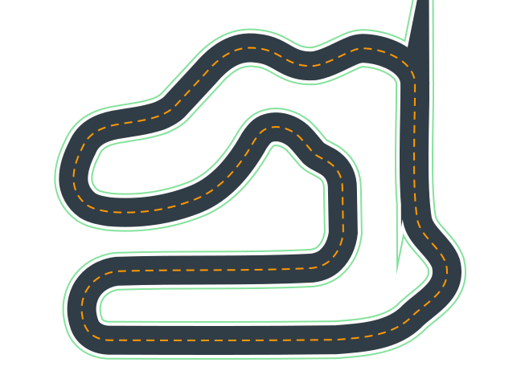                            | **Ross Super Speedway**                  | *2022-05-01T00:00:00Z* | [2022_may_pro.npy](././npy/2022_may_pro.npy) [2022_may_pro_cw.npy](././npy/2022_may_pro_cw.npy) [2022_may_pro_ccw.npy](././npy/2022_may_pro_ccw.npy)                                                 | 63.92 meters   | 1.07 meters   |
| 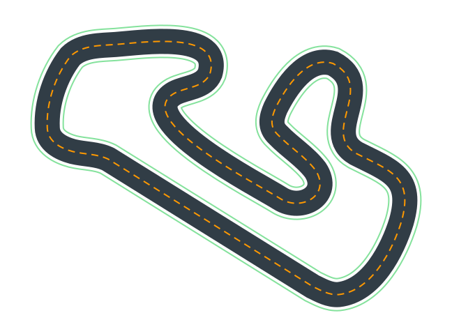                         | **Ace Super Speedway**                   | *2022-04-01T00:00:00Z* | [2022_april_pro_cw.npy](././npy/2022_april_pro_cw.npy) [2022_april_pro_ccw.npy](././npy/2022_april_pro_ccw.npy) [2022_april_pro.npy](././npy/2022_april_pro.npy)                                     | 67.46 meters   | 1.07 meters   |
| 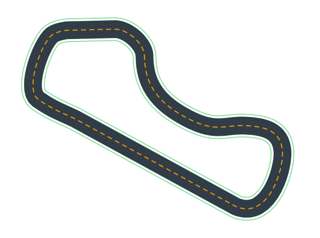                             | **Ace Speedway**                         | *2022-04-01T00:00:00Z* | [2022_april_open.npy](././npy/2022_april_open.npy) [2022_april_open_ccw.npy](././npy/2022_april_open_ccw.npy) [2022_april_open_cw.npy](././npy/2022_april_open_cw.npy)                               | 50.30 meters   | 1.07 meters   |
| 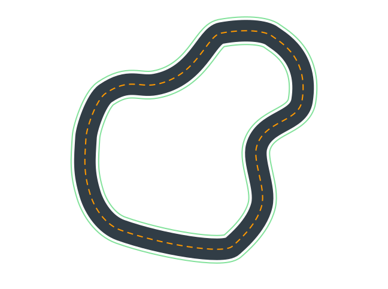                            | **Rogue Circuit**                        | *2022-03-01T00:00:00Z* | [2022_march_open.npy](././npy/2022_march_open.npy) [2022_march_open_ccw.npy](././npy/2022_march_open_ccw.npy) [2022_march_open_cw.npy](././npy/2022_march_open_cw.npy)                               | 48.07 meters   | 1.07 meters   |
| 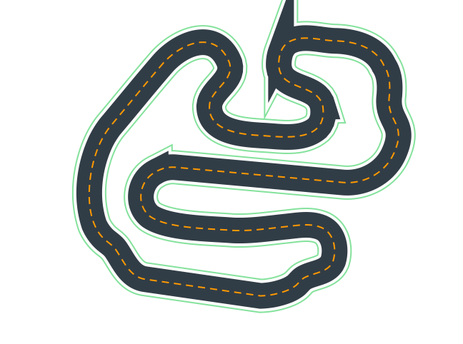                              | **Rogue Raceway**                        | *2022-03-01T00:00:00Z* | [2022_march_pro_cw.npy](././npy/2022_march_pro_cw.npy) [2022_march_pro.npy](././npy/2022_march_pro.npy) [2022_march_pro_ccw.npy](././npy/2022_march_pro_ccw.npy)                                     | 76.76 meters   | 1.07 meters   |
|                     | **RL Speedway**                          | *2022-02-01T00:00:00Z* | [2022_summit_speedway.npy](././npy/2022_summit_speedway.npy) [2022_summit_speedway_cw.npy](././npy/2022_summit_speedway_cw.npy) [2022_summit_speedway_ccw.npy](././npy/2022_summit_speedway_ccw.npy) | 25.24 meters   | 1.07 meters   |
| 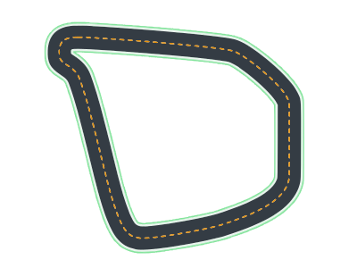                                     | **Vivalas Loop**                         | *2021-10-30T10:00:00Z* | [caecer_loop.npy](././npy/caecer_loop.npy)                                                                                                                                                           | 39.12 meters   | 1.08 meters   |
|                                      | **Vivalas Speedway**                     | *2021-10-30T00:00:00Z* | [caecer_gp.npy](././npy/caecer_gp.npy)                                                                                                                                                               | 73.78 meters   | 1.08 meters   |
| 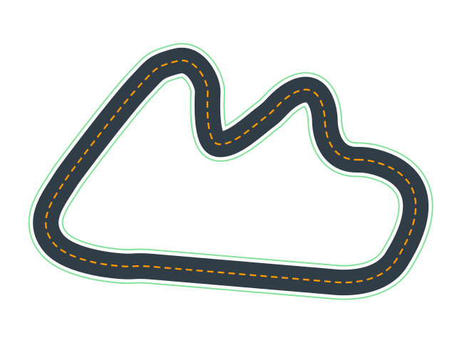                              | **Expedition Loop**                      | *2021-09-30T17:00:00Z* | [red_star_open.npy](././npy/red_star_open.npy)                                                                                                                                                       | 43.47 meters   | 0.01 meters   |
| 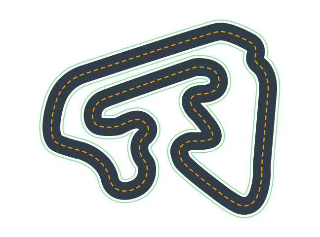                          | **Expedition Super Loop**                | *2021-09-30T16:58:00Z* | [red_star_pro_cw.npy](././npy/red_star_pro_cw.npy) [red_star_pro.npy](././npy/red_star_pro.npy) [red_star_pro_ccw.npy](././npy/red_star_pro_ccw.npy)                                                 | 69.17 meters   | 0.01 meters   |
|                                 | **Playa Super Raceway**                  | *2021-09-01T00:00:00Z* | [morgan_pro.npy](././npy/morgan_pro.npy)                                                                                                                                                             | 59.57 meters   | 0.01 meters   |
|                                     | **Playa Raceway**                        | *2021-09-01T00:00:00Z* | [morgan_open.npy](././npy/morgan_open.npy)                                                                                                                                                           | 45.06 meters   | 0.01 meters   |
|                              | **Hot Rod Super Speedway**               | *2021-07-31T00:00:01Z* | [arctic_pro_ccw.npy](././npy/arctic_pro_ccw.npy) [arctic_pro_cw.npy](././npy/arctic_pro_cw.npy) [arctic_pro.npy](././npy/arctic_pro.npy)                                                             | 59.50 meters   | 0.01 meters   |
| 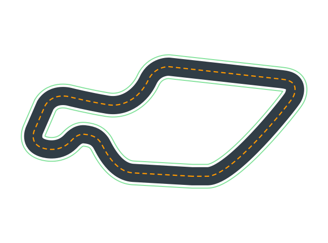                                 | **Hot Rod Speedway**                     | *2021-07-31T00:00:01Z* | [arctic_open_cw.npy](././npy/arctic_open_cw.npy) [arctic_open_ccw.npy](././npy/arctic_open_ccw.npy) [arctic_open.npy](././npy/arctic_open.npy)                                                       | 42.21 meters   | 0.01 meters   |
| 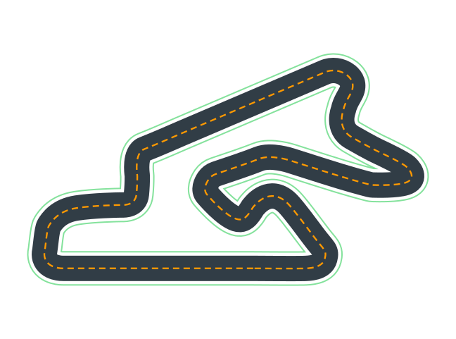                                         | **Baja Highway**                         | *2021-06-30T16:58:00Z* | [dubai_pro.npy](././npy/dubai_pro.npy)                                                                                                                                                               | 64.67 meters   | 0.01 meters   |
| 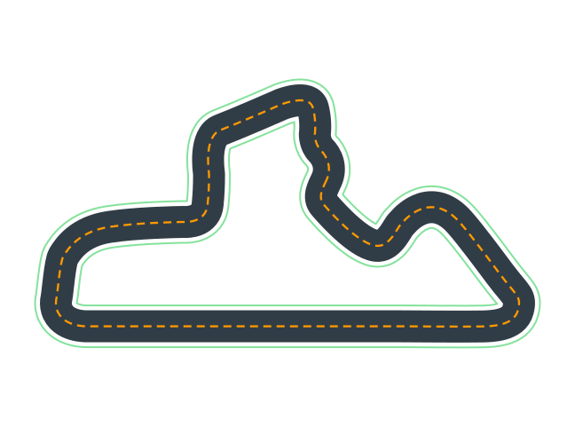                                      | **Baja Turnpike**                        | *2021-06-30T16:58:00Z* | [dubai_open_cw.npy](././npy/dubai_open_cw.npy) [dubai_open.npy](././npy/dubai_open.npy) [dubai_open_ccw.npy](././npy/dubai_open_ccw.npy)                                                             | 40.56 meters   | 0.01 meters   |
|                                  | **Kuei Raceway**                         | *2021-06-10T23:45:00Z* | [hamption_open.npy](././npy/hamption_open.npy)                                                                                                                                                       | 45.93 meters   | 0.01 meters   |
| 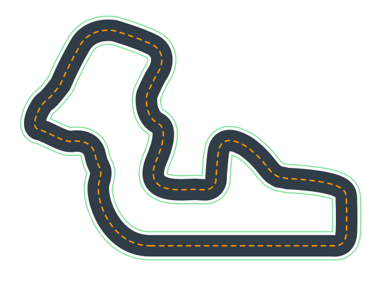                     | **Cosmic Circuit**                       | *2021-05-25T21:28:41Z* | [jyllandsringen_pro_cw.npy](././npy/jyllandsringen_pro_cw.npy) [jyllandsringen_pro.npy](././npy/jyllandsringen_pro.npy) [jyllandsringen_pro_ccw.npy](././npy/jyllandsringen_pro_ccw.npy)             | 62.02 meters   | 0.01 meters   |
| 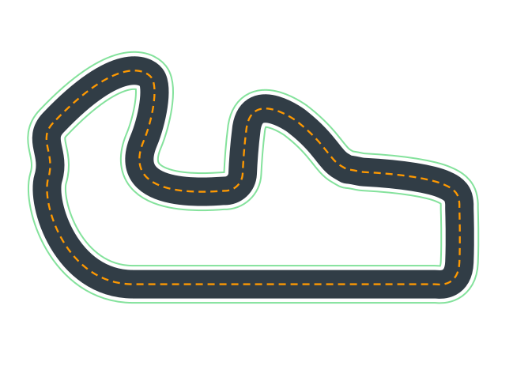                      | **Cosmic Loop**                          | *2021-05-25T21:14:49Z* | [jyllandsringen_open.npy](././npy/jyllandsringen_open.npy) [jyllandsringen_open_ccw.npy](././npy/jyllandsringen_open_ccw.npy) [jyllandsringen_open_cw.npy](././npy/jyllandsringen_open_cw.npy)       | 46.12 meters   | 0.01 meters   |
| 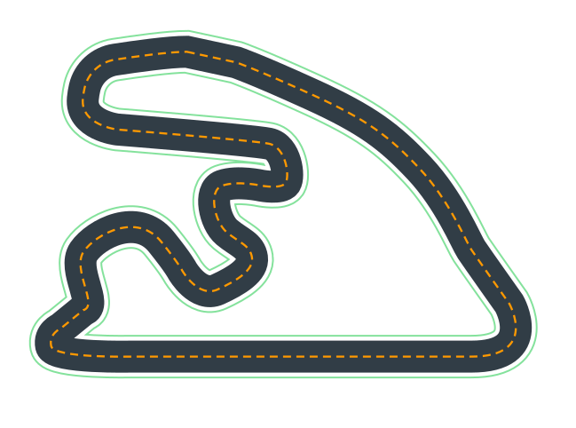                             | **Kuei Super Raceway**                   | *2021-05-01T00:00:00Z* | [hamption_pro.npy](././npy/hamption_pro.npy)                                                                                                                                                         | 60.74 meters   | 0.01 meters   |
| 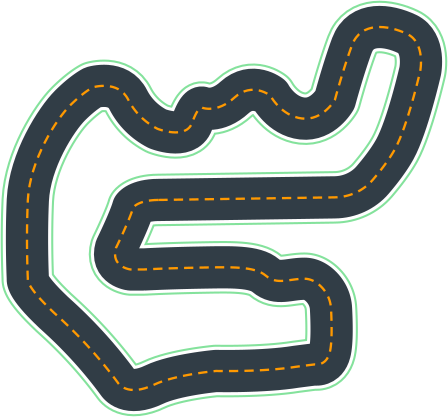                           | **Lars Circuit**                         | *2021-04-01T00:00:01Z* | [thunder_hill_pro_ccw.npy](././npy/thunder_hill_pro_ccw.npy) [thunder_hill_pro_cw.npy](././npy/thunder_hill_pro_cw.npy) [thunder_hill_pro.npy](././npy/thunder_hill_pro.npy)                         | 59.23 meters   | 1.07 meters   |
| 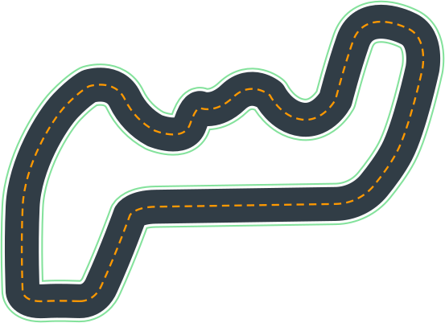                            | **Lars Loop**                            | *2021-04-01T00:00:01Z* | [thunder_hill_open.npy](././npy/thunder_hill_open.npy)                                                                                                                                               | 41.55 meters   | 1.07 meters   |
|                                  | **Po-Chun Speedway**                     | *2021-03-01T01:00:00Z* | [penbay_open_ccw.npy](././npy/penbay_open_ccw.npy) [penbay_open.npy](././npy/penbay_open.npy) [penbay_open_cw.npy](././npy/penbay_open_cw.npy)                                                       | 68.68 meters   | 1.07 meters   |
|                              | **Po-Chun Super Speedway**               | *2021-03-01T01:00:00Z* | [penbay_pro.npy](././npy/penbay_pro.npy) [penbay_pro_cw.npy](././npy/penbay_pro_cw.npy) [penbay_pro_ccw.npy](././npy/penbay_pro_ccw.npy)                                                             | 89.24 meters   | 1.07 meters   |
| 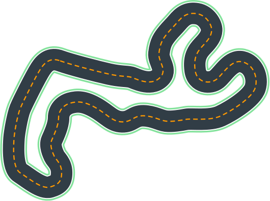     | **European Seaside Circuit - Buildings** | *2021-01-04T00:00:00Z* | [Monaco_building.npy](././npy/Monaco_building.npy)                                                                                                                                                   | 60.00 meters   | 1.28 meters   |
|   | **Asia Pacific Bay Loop - Buildings**    | *2021-01-04T00:00:00Z* | [Singapore_building.npy](././npy/Singapore_building.npy)                                                                                                                                             | 60.00 meters   | 1.35 meters   |
|                                     | **American Hills Speedway**              | *2020-11-10T00:00:00Z* | [Austin.npy](././npy/Austin.npy)                                                                                                                                                                     | 59.00 meters   | 1.31 meters   |
| 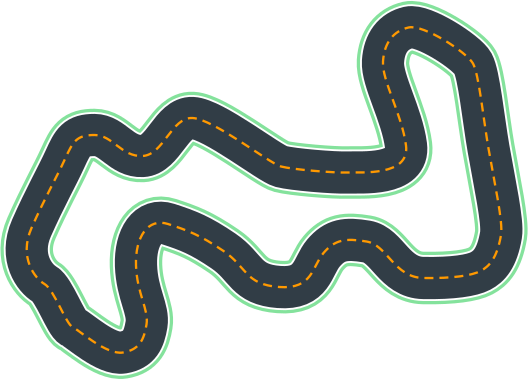                                | **Asia Pacific Bay Loop**                | *2020-11-10T00:00:00Z* | [Singapore.npy](././npy/Singapore.npy)                                                                                                                                                               | 60.00 meters   | 1.35 meters   |
|                                    | **European Seaside Circuit**             | *2020-11-10T00:00:00Z* | [Monaco.npy](././npy/Monaco.npy)                                                                                                                                                                     | 60.00 meters   | 1.28 meters   |
| 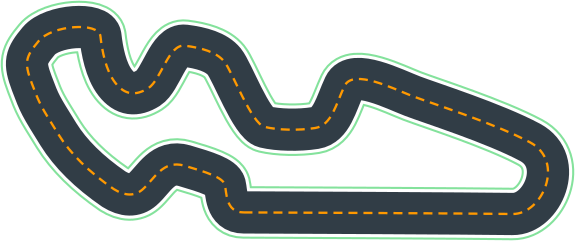                                               | **Stratus Loop**                         | *2020-10-01T00:00:00Z* | [Aragon.npy](././npy/Aragon.npy)                                                                                                                                                                     | 60.00 meters   | 1.05 meters   |
|                                           | **Cumulo Turnpike**                      | *2020-09-01T00:00:00Z* | [Belille.npy](././npy/Belille.npy)                                                                                                                                                                   | 60.00 meters   | 1.06 meters   |
| 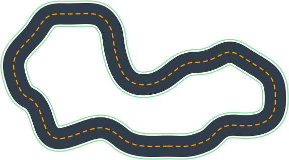                                               | **Yun Speedway**                         | *2020-08-01T00:00:00Z* | [Albert.npy](././npy/Albert.npy)                                                                                                                                                                     | 51.00 meters   | 1.07 meters   |
|                                         | **Roger Raceway**                        | *2020-07-01T00:00:00Z* | [July_2020.npy](././npy/July_2020.npy)                                                                                                                                                               | 60.00 meters   | 1.07 meters   |
|                                      | **Fumiaki Loop**                         | *2020-06-01T00:00:00Z* | [FS_June2020.npy](././npy/FS_June2020.npy)                                                                                                                                                           | 53.00 meters   | 1.07 meters   |
|                    | **Circuit de Barcelona-Catalunya**       | *2020-05-01T00:00:00Z* | [Spain_track.npy](././npy/Spain_track.npy)                                                                                                                                                           | 60.00 meters   | 1.07 meters   |
|                      | **Smile Speedway**                       | *2020-04-01T00:00:00Z* | [reInvent2019_track.npy](././npy/reInvent2019_track.npy) [reInvent2019_track_cw.npy](././npy/reInvent2019_track_cw.npy) [reInvent2019_track_ccw.npy](././npy/reInvent2019_track_ccw.npy)             | 23.12 meters   | 1.07 meters   |
|                                | **re:Invent 2018**                       | *2020-03-01T00:00:00Z* | [reinvent_base.npy](././npy/reinvent_base.npy)                                                                                                                                                       | 17.60 meters   | 0.76 meters   |
|        | **Baadal Track**                         | *2020-02-01T00:00:00Z* | [AmericasGeneratedInclStart.npy](././npy/AmericasGeneratedInclStart.npy)                                                                                                                             | 39.00 meters   | 1.07 meters   |
|                                             | **SOLA Speedway**                        | *2020-01-01T00:00:00Z* | [LGSWide.npy](././npy/LGSWide.npy)                                                                                                                                                                   | 38.00 meters   | 1.06 meters   |
|                                | **AWS Summit Raceway**                   | *2019-12-01T00:00:00Z* | [Vegas_track.npy](././npy/Vegas_track.npy)                                                                                                                                                           | 22.57 meters   | 0.91 meters   |
|                 | **Toronto Turnpike Training**            | *2019-10-01T00:00:00Z* | [Canada_Training.npy](././npy/Canada_Training.npy)                                                                                                                                                   | 21.74 meters   | 0.76 meters   |
| 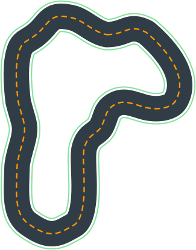                        | **Cumulo Carrera Training**              | *2019-09-01T00:00:00Z* | [Mexico_track.npy](././npy/Mexico_track.npy)                                                                                                                                                         | 20.51 meters   | 0.76 meters   |
| 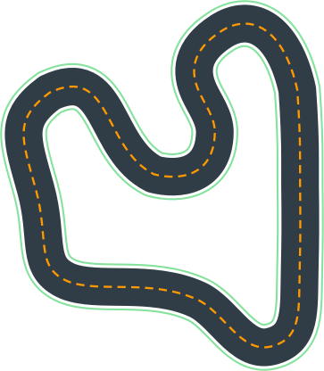                           | **Shanghai Sudu Training**               | *2019-08-01T00:00:00Z* | [China_track.npy](././npy/China_track.npy)                                                                                                                                                           | 22.92 meters   | 0.76 meters   |
|                        | **Empire City Training**                 | *2019-07-01T00:00:00Z* | [New_York_Track.npy](././npy/New_York_Track.npy)                                                                                                                                                     | 21.88 meters   | 0.76 meters   |
|           | **Kumo Torakku Training**                | *2019-06-01T00:00:00Z* | [Tokyo_Training_track.npy](././npy/Tokyo_Training_track.npy)                                                                                                                                         | 22.63 meters   | 0.76 meters   |
|  | **London Loop Training**                 | *2019-05-01T00:00:00Z* | [Virtual_May19_Train_track.npy](././npy/Virtual_May19_Train_track.npy)                                                                                                                               | 19.45 meters   | 0.76 meters   |
| 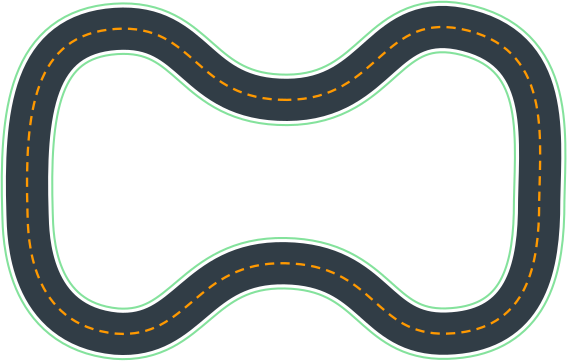                                   | **Bowtie Track**                         | *2019-04-01T00:00:00Z* | [Bowtie_track.npy](././npy/Bowtie_track.npy)                                                                                                                                                         | 17.43 meters   | 0.76 meters   |
|                                          | **Oval Track**                           | *2019-03-01T00:00:00Z* | [Oval_track.npy](././npy/Oval_track.npy)                                                                                                                                                             | 19.55 meters   | 0.76 meters   |
| 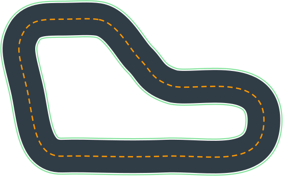                      | **A to Z Speedway**                      | *2019-02-01T00:00:00Z* | [reInvent2019_wide_cw.npy](././npy/reInvent2019_wide_cw.npy) [reInvent2019_wide.npy](././npy/reInvent2019_wide.npy) [reInvent2019_wide_ccw.npy](././npy/reInvent2019_wide_ccw.npy)                   | 16.64 meters   | 1.07 meters   |
    